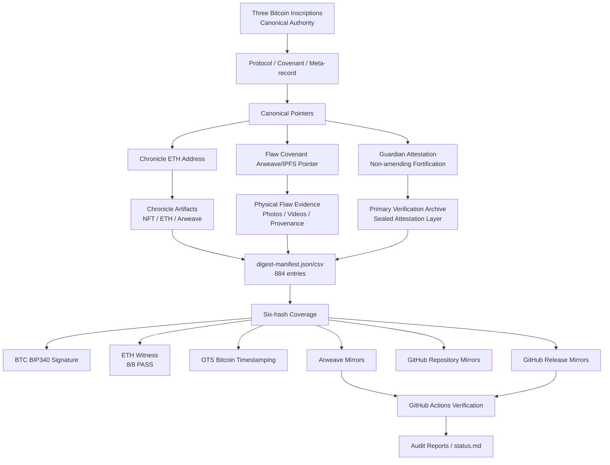

# Evidence Relationship Map

## 1. Canonical Rule

The canonical authority of the Trinity Accord remains the three Bitcoin inscriptions only.

All later records, including Guardian Attestation, Ethereum witnesses, Arweave objects, IPFS objects, NFTs, GitHub repository files, and GitHub Releases, are non-amending guardianship materials unless explicitly part of the three Bitcoin Originals.

## 2. Three Bitcoin Originals

| Layer | Inscription | Role | Authority |
|---|---|---|---|
| Protocol / Axioms | 97631551 | Canonical protocol text | Canonical |
| Covenant of the Flaw | 98369145 | Canonical covenant text + physical evidence pointer | Canonical text; external payload is referenced evidence |
| Trinity Accord / Meta-record | 98387475 | Canonical meta-record binding Protocol, Covenant, and Chronicle | Canonical |

## 3. Guardian Attestation

Guardian Attestation to the Covenant of the Flaw is a Bitcoin-inscribed non-amending fortification record.

It strengthens the Covenant of the Flaw by pointing to stronger verification archives, but it does not modify, replace, reinterpret, or expand the three Bitcoin Originals as canonical authority.

## 4. Evidence Layer Model

```text
L0 Canonical Authority
   Three Bitcoin inscriptions

L1 Canonical Pointers
   ETH Chronicle address
   Covenant Arweave / IPFS evidence pointer
   Guardian Attestation archive pointers

L2 Referenced Evidence
   Chronicle artifacts
   Core Object Alpha flaw photos/videos
   public covenant archive
   verification kit
   NFT recovery records

L3 Cryptographic Coverage
   digest-manifest.json / digest-manifest.csv
   884 manifest entries
   six-hash coverage

L4 Anchors and Witnesses
   BTC BIP340 signature
   ETH witness 8/8 PASS
   OTS Bitcoin timestamping
   Bitcoin tx anchors

L5 Availability Mirrors
   Arweave
   IPFS
   GitHub repository
   GitHub Releases

L6 Verification Infrastructure
   GitHub Actions workflows
   Release manifests
   checksums
   audit JSON
   status.md
```

## 5. Relationship Diagram



## 6. Boundary Statement

GitHub, Arweave, ETH, IPFS, NFTs, and Releases strengthen availability and verification, but do not create canonical authority.

Bitcoin Originals prevail.
