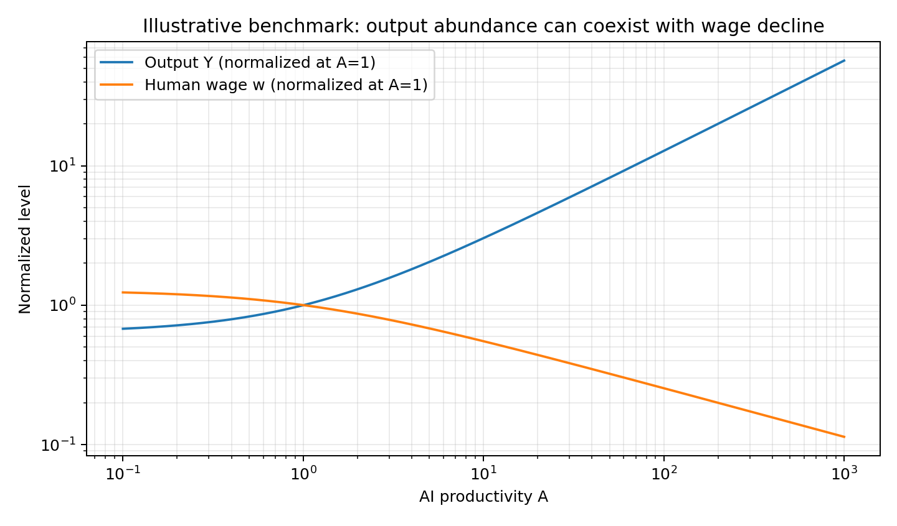
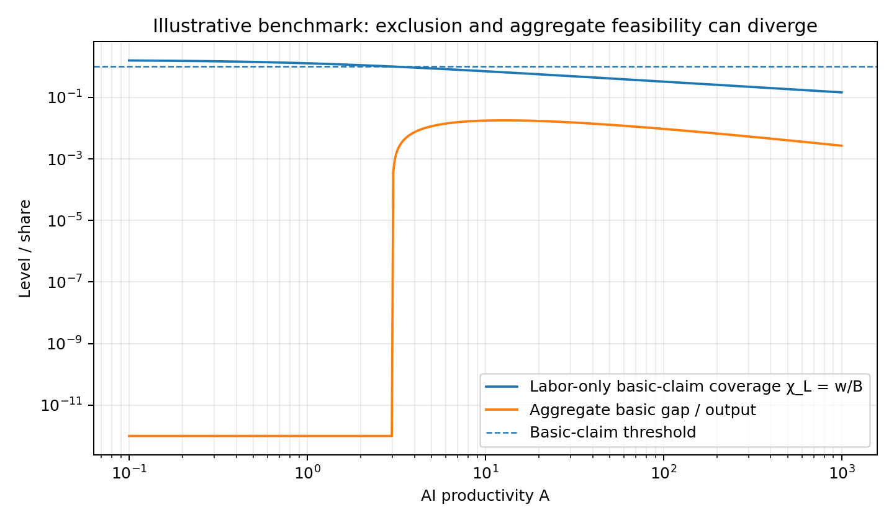

**THE CLAIM ARCHITECTURE TRANSITION**

*Transformative AI, Real Claim Closure, and General Equilibrium Beyond Wage-Based Distribution*

Hongju Liu

TA-TR-2026-14 · Working Paper v1.1 · 21 September 2026

DOI: 10.5281/zenodo.22871209

*Status: completed theoretical manuscript for external critique; not peer reviewed.*

> **AI-assistance statement.** This manuscript was developed with substantial assistance from OpenAI ChatGPT (GPT-5.6 Sol) for literature search, mathematical checking, numerical illustration, and drafting. The named human author is responsible for deciding whether to circulate, revise, or publish the manuscript and for any claims made in a public version.
>
> **Research-position statement.** The paper deliberately makes a narrower originality claim than the phrase "post-labor economics" suggests. It does not claim to originate the ideas that automation can lower labor's share, that ownership matters, that abundance need not imply access, or that scarce inputs can dominate wage purchasing power. Its proposed contribution is the claim-architecture formalization, the joint real-claim phase condition, and the separation of employment, market clearing, and basic-claim inclusion in one tractable framework.

# Abstract

Transformative-AI economics often asks whether human labor will disappear. This paper asks a different question: what keeps a welfare-bearing person connected to social output when wage income ceases to be a broadly distributed claim on production? I define a claim architecture as the set of market and institutional channels through which households can command a specified basic bundle. In a competitive benchmark with a fixed scarce factor and AI-augmented machine capital, AI productivity can send output to infinity while driving the real market claim of labor-only households toward zero. This can occur under full human employment, and goods markets can continue to clear. A CES extension yields the paper's main phase condition. If the elasticity of substitution between human and AI-effective input is σ\>1, the fixed-factor share is β, and the price of a household's basic bundle is asymptotically proportional to A\^g, then labor-only basic-claim coverage is proportional to A\^(1/σ−β−g). Labor's income share converges to zero throughout this region, but the absolute wage and the ability to buy essentials can rise, fall, or remain bounded depending on the same phase condition. A general claim-closure result then shows that the asymptotic viability of a household is determined by the fastest-growing nonnegative claim channel relative to the growth of its net essential expenditure. Finally, applying the standard poverty-gap concept to the AI path shows an abundance--exclusion divergence: a positive mass of households can lose market-generated basic-claim inclusion while the real resources required to close the aggregate basic gap become negligible as a share of output. The framework is mechanism-neutral: labor complementarity, broad asset ownership, transfers or social dividends, direct provision, and essential-price deflation are alternative channels that can close the same accounting condition. The paper therefore does not prescribe a political system; it supplies a stress test for whether a post-labor distribution architecture remains materially closed for the people whose welfare it is intended to serve.

Keywords: transformative AI; automation; general equilibrium; income distribution; entitlements; purchasing power; basic needs; post-labor economy; AI ownership; public finance.

JEL codes: D31, D50, E24, H53, O33, O41.

# 中文研究摘要

本文研究的核心并不是"AGI 会不会造成多少失业"，而是一个更基础的问题：如果人类劳动不再是大多数人取得社会产出的主要市场索取渠道，那么人如何继续获得基本生活资源？论文把工资、资本/AI 所有权收益、转移支付、直接公共或共同服务以及基本品价格共同放入"索取权架构"中。最重要的理论结果是：劳动收入占比趋近于零，并不能推出工资一定下降；工资下降，也不能单独推出基本生活能力下降。真正决定结果的是"劳动可获得收入相对于基本生活篮子价格"的变化。CES 模型给出一个明确的相变条件：劳动型基本索取覆盖率的渐近变化率由 1/σ−β−g 决定，其中 σ 是人机替代弹性、β 是不可复制稀缺要素的产出份额、g 是基本生活篮子真实价格随 AI 能力变化的指数。论文进一步证明，在一个完全竞争、完全就业的基准经济中，也可以出现一部分劳动型家庭的基本索取权失效，同时市场仍然出清；因此失业率不是判断后劳动分配风险的充分指标。最后，论文区分"市场自己生成的索取权闭环"和"制度补充后的索取权闭环"，并提出一组可用于现实转型压力测试的指标。该理论不预设市场、计划或某一种再分配制度优越，而是要求任何制度回答同一个可检验问题：当劳动这条广泛分布的索取渠道衰减时，是否存在另一条足够广泛、足够耐久的渠道把福利主体重新连接到社会产出。

# 1. Introduction

The distributional problem posed by transformative artificial intelligence is frequently narrated as a problem of technological unemployment. That framing is natural but incomplete. Employment is only one way in which a person acquires a claim on social output, and unemployment is only one way in which that claim can weaken. A worker can remain employed at a wage that buys progressively less of the goods that matter; a person can leave the labor force while remaining wealthy through ownership; a society can experience a vanishing labor share while absolute wages still rise; and a market can clear while some welfare-bearing households cannot command a socially defined minimum bundle. The object that must be tracked is therefore not employment alone, but the architecture of claims connecting people to output.

This distinction matters because the frontier literature has moved quickly. Acemoglu and Restrepo (2018, 2022) established a task-based framework in which automation creates a displacement effect but can be countered by productivity and reinstatement through new tasks. Restrepo (2025, 2026) considers a much more extreme AGI limit in which compute can perform all economically valuable work; as compute expands, wages approach the opportunity cost of reproducing human work and labor's share of income converges to zero. Mookherjee and Ray (2022) likewise show that automation can drive labor's long-run income share downward even while absolute real wages rise. Jones (2026) therefore warns against equating a falling labor share with falling wages and explicitly notes that labor has historically been the main asset or endowment owned by many households. The central distributional question is what economically valuable endowment will replace that role if AI can perform nearly every human task.

Recent work has also moved directly onto purchasing power and ownership. Båge and Wilson (2026) derive bounds showing that, when automation makes wages cheap relative to rents on non-produced scarce inputs, wage purchasing power can collapse for consumption categories with persistent land requirements; their paper also analyzes subsistence coverage and rent-funded transfers. Lagarda, Marin, and Verastegui (2026) show in an overlapping-generations model that worker ownership of AI capital can offset wage losses above an ownership threshold. Hazari and Mohan (2024) provide a general-equilibrium model in which a group excluded from productive asset ownership can lose income as AI capital grows even while workers remain employed. Kalantzis and Grislain (2026) study an agent with declining labor income and a subsistence floor. Korinek and Lockwood (2026) show that transformative AI can erode labor-income and eventually human-consumption tax bases. These contributions make it impossible to defend a broad claim such as 'AI destroys wages, therefore a new distribution system is needed' as a high-originality result.

The paper instead proposes a narrower object: claim architecture. A claim architecture records the channels through which a welfare-bearing household can command a specified real bundle, and it keeps separate five margins that are often collapsed in discussion: the labor income share, the absolute wage, the price of essential goods, nonlabor ownership claims, and institutional or direct-provision claims. The core question is not whether one channel declines, but whether the sum of durable channels grows at least as fast as the real cost of the bundle that defines basic inclusion.

The first contribution is a tractable competitive benchmark that separates employment from claim viability. Human labor is supplied inelastically and remains fully employed. AI productivity raises output, reduces the marginal product of human labor in the benchmark, and transfers a growing share of income toward machine capital and a fixed scarce factor. Labor-only households can cross below a basic-claim threshold even though there is no technological unemployment. Because factor payments exhaust output, goods markets continue to clear. This is not offered as a new theorem about the existence of exclusion in general equilibrium; Sen's entitlement framework and later equilibrium work make clear that aggregate availability and individual command are distinct. Its purpose is to isolate an AGI technology path along which employment, market clearing, and human inclusion separate.

The second and main contribution is a CES robustness result. Let σ\>1 denote the elasticity of substitution between human labor and AI-effective machine input, β the production share of a fixed scarce factor, and let the cost of an individual's specified basic bundle scale as A\^g with AI productivity A. Then labor-only basic-claim coverage scales as A\^(1/σ−β−g). The expression generates three regimes. Coverage collapses if g\>1/σ−β, stays asymptotically bounded if equality holds, and improves if g\<1/σ−β. Labor's income share tends to zero in all three regimes. The same economy can therefore exhibit a vanishing labor share with rising basic purchasing power, or a rising absolute wage with falling basic purchasing power. A single statistic such as the labor share, average wage, or unemployment rate does not identify the distributional state.

The third contribution is a general claim-closure condition. If each nonnegative claim channel and the household's net essential expenditure obey power-law asymptotics in AI productivity, then the asymptotic status of claim coverage is determined by the largest growth exponent among claim channels relative to the essential-expenditure exponent. This turns a list of institutional options into one common accounting problem. Labor complementarity changes the labor channel; broad ownership changes capital claims; transfers or social dividends add a fiscal or common-asset channel; direct provision reduces the market expenditure that a household must finance; and essential-price deflation reduces the denominator. No single mechanism is mathematically necessary. At least one sufficiently broad and durable mechanism is.

The fourth contribution links this architecture to a practical stress test. Applying the standard poverty-gap concept---not claiming to invent it---to the AI transition produces an abundance--exclusion divergence. In the benchmark, a positive mass of labor-only households can fall below the basic threshold while the aggregate gap required to bring everyone to that threshold becomes arbitrarily small as a fraction of total output. The implication is not that closing the gap is administratively easy: information, targeting, incentive, political, and legitimacy costs remain. The result is narrower. It distinguishes technological feasibility from distributional incidence. A society can become materially capable of closing a basic gap at negligible output cost while its market-generated claim architecture moves in the opposite direction.

The analysis is explicitly conditional, not a prediction that current AI will imminently eliminate work. The 2026 U.S. Census Bureau AI supplement reports that 18 percent of firms used AI in a business function during the reference period (32 percent on an employment-weighted basis), and employment decreases associated with AI remained rare. The model is therefore a stress test for a transformative-AI limit rather than a description of the current economy. That distinction is essential if theory is to guide practice without turning scenario analysis into forecast certainty.

# 2. Literature boundary and originality claim

A useful test of a theoretical contribution is to state what would remain if its broad intuitions were removed. Table 1 makes that boundary explicit. Several ideas motivating this paper are established: abundance need not imply access; automation can lower labor's share; wages can be anchored by machine substitutes; scarce factors can determine real purchasing power; ownership of AI capital changes distribution; and full employment does not guarantee that all groups gain. The proposed novelty is therefore not any one of those statements in isolation.

  ---------------------------------------------------------------------------------------------------------------------------------------------------------------------------------------------------------------------------------------------------------------------------------------------------------------------------------------------------------------------------------------------------
  **Nearest literature**                                   **What it already establishes**                                                                                              **What this paper does not claim**                                            **Residual contribution used here**
  -------------------------------------------------------- ---------------------------------------------------------------------------------------------------------------------------- ----------------------------------------------------------------------------- -------------------------------------------------------------------------------------------------------------------------------
  Sen (1981)                                               Availability and entitlement are distinct; command over goods depends on endowments and exchange mappings.                   "Abundance without access" is not new.                                        Applies entitlement logic to an endogenous TAI technology path and separates market, transfer, provision, and price channels.

  Acemoglu & Restrepo (2018, 2022); Restrepo (2025/2026)   Automation displaces tasks; AGI can push labor's income share toward zero.                                                   A vanishing labor share is not new.                                           Shows why labor share alone does not identify real basic-claim viability.

  Jones (2026); Mookherjee & Ray (2022)                    Labor is a major household endowment; labor share can fall while real wages rise.                                            The "labor endowment" observation is not new.                                 Derives a joint wage--essential-price phase condition.

  Båge & Wilson (2026)                                     Scarce inputs can cause wage purchasing power over land-intensive goods to vanish; subsistence and transfers are analyzed.   A wage/subsistence ratio or scarce-input mechanism is not claimed as first.   Generalizes to a CES exponent condition and embeds multiple claim channels in one architecture.

  Hazari & Mohan (2024)                                    AI-capital growth can hurt an asset-excluded group even with full employment.                                                Full-employment exclusion by itself is not new.                               Makes full-employment claim failure a benchmark diagnostic and links it to a general coverage measure.

  Lagarda et al. (2026); Moll et al. (2022)                Asset ownership strongly conditions who benefits from automation.                                                            "Ownership matters" is not new.                                               Treats ownership as one of several substitutable claim-closure channels.

  Korinek & Lockwood (2026)                                TAI can erode labor and human-consumption tax bases.                                                                         Tax-base erosion is not new.                                                  Uses fiscal durability as one stress-test dimension inside claim architecture.

  Poverty-gap literature                                   Aggregate income shortfall below a poverty line is a standard measure.                                                       The gap functional is not new.                                                Studies its asymptotic ratio to AI-expanded output jointly with market-generated exclusion.
  ---------------------------------------------------------------------------------------------------------------------------------------------------------------------------------------------------------------------------------------------------------------------------------------------------------------------------------------------------------------------------------------------------

*Table 1. Boundary of the originality claim. The paper's contribution is the joint formalization, not the component intuitions.*

This boundary produces a more defensible claim: the paper develops a common state variable---real claim coverage---and derives a phase condition that simultaneously respects substitution technology, the fixed-factor bottleneck, essential-price dynamics, and nonlabor claim channels. The term 'claim architecture' is used descriptively for that mapping; it is not a claim that no earlier literature has used similar language. The relevant originality test is whether the model yields distinct propositions and measurements not already contained in the nearest papers.

Two results meet that narrower test most clearly. First, the CES phase condition identifies why labor-share collapse is compatible with three opposite paths for labor-only basic purchasing power. Second, the general claim-closure exponent result puts market claims, asset income, transfers, and net essential expenditure on the same asymptotic footing. The remaining results---full-employment failure, market-clearing exclusion, and the poverty-gap/output comparison---should be read as diagnostic consequences and synthesis, not as claims of mathematical first discovery.

# 3. Claim architecture: definitions

Consider a continuum of welfare-bearing households i∈\[0,1\]. The phrase welfare-bearing is deliberate. AI systems may act, transact, and produce, but the model does not need to take a position on AI consciousness or moral status. The population used for the basic-inclusion accounting is simply the population whose material welfare the analyst or institution has chosen to protect. The model can be extended to other welfare bearers if that normative set changes.

Let Bᵢ(A)\>0 denote the minimum market expenditure, at the prevailing price vector, required to purchase a specified reference bundle for household i when AI productivity is A. Bᵢ may be a poverty threshold, a subsistence basket, a policy-defined minimum consumption bundle, or a Hicksian expenditure function evaluated at a minimum utility level. This paper does not assert that basic-bundle coverage is a complete measure of welfare. It is a deliberately narrow feasibility concept.

  ----------------------------------------------------------------------------------
  $$m_{i}(A) = w(A)\ell_{i} + r_{K}(A)k_{i} + r_{R}(A)r_{i} + \pi_{i}(A)$$   \(1\)
  -------------------------------------------------------------------------- -------

  ----------------------------------------------------------------------------------

Here mᵢ is the household's pre-transfer market claim: labor income plus claims on reproducible capital, non-produced scarce factors, and any distributed profits not already exhausted by factor payments. Let Tᵢ(A)≥0 denote cash-like transfers or social dividends. Let Dᵢ(A)∈\[0,Bᵢ(A)\] denote the market-equivalent value of components of the reference bundle delivered directly---through public, mutual, employer, household, or other nonmarket provision. Define net essential market expenditure nᵢ(A)=Bᵢ(A)−Dᵢ(A).

  ----------------------------------------------------------------------------------------
  $$\chi_{i}(A) = \frac{m_{i}(A) + T_{i}(A)}{n_{i}(A)},\quad\quad n_{i}(A) > 0$$   \(2\)
  -------------------------------------------------------------------------------- -------

  ----------------------------------------------------------------------------------------

χᵢ is the basic-claim coverage ratio. A household is basic-claim included if χᵢ≥1. If direct provision covers the entire reference bundle so that nᵢ=0, define the household as materially closed for this narrow bundle regardless of cash income. The market-generated ratio χᵢᴹ=mᵢ/Bᵢ removes T and D and asks what the market alone delivers under the specified ownership structure.

  ------------------------------------------------------------------------------------------------------------
  $$I_{M}(A) = \mu\{ i:\chi_{i}^{M}(A) \geq 1\},\quad\quad I_{C}(A) = \mu\{ i:\chi_{i}(A) \geq 1\}$$   \(3\)
  ---------------------------------------------------------------------------------------------------- -------

  ------------------------------------------------------------------------------------------------------------

Iₘ is the market-generated basic-inclusion rate, while I꜀ is the total inclusion rate after the institutionally defined transfer and direct-provision channels. Their difference is analytically useful: it shows how much inclusion comes from market factor ownership and how much comes from additional claim architecture. Neither is a moral ranking of economic systems.

> **Relation to Sen:** *The construction is indebted to Sen's entitlement distinction between aggregate availability and a person's command over goods. The narrower term "claim" is used because the present model tracks a priced reference bundle and an explicit decomposition of channels rather than attempting to reproduce the full entitlement approach.*

# 4. A competitive benchmark: abundance with labor-claim decay

The benchmark is intentionally minimal. It is not meant to reproduce task assignment, endogenous automation, or wealth accumulation. Its role is to establish that employment, output growth, market clearing, and basic-claim inclusion are logically distinct state variables.

There is one final consumption good. Production uses a fixed non-produced factor R\>0, human labor L\>0, and a stock K\>0 of machine capital whose effective services are multiplied by AI productivity A\>0. Human labor and AI-effective machine services are perfect substitutes within the produced composite. Technology is:

  -----------------------------------------------------------------------------------------
  $$Y(A) = ZR^{\beta}\lbrack L + AK\rbrack^{1 - \beta},\quad\quad 0 < \beta < 1$$   \(4\)
  --------------------------------------------------------------------------------- -------

  -----------------------------------------------------------------------------------------

All factor stocks are supplied inelastically in the one-period benchmark. In particular, all L units of human labor are employed at the competitive wage. This assumption is stronger than needed for many distributional results, but it deliberately rules out unemployment as the mechanism driving claim failure.

  -------------------------------------------------------------------------
  $$w(A) = Z(1 - \beta)R^{\beta}\lbrack L + AK\rbrack^{- \beta}$$   \(5\)
  ----------------------------------------------------------------- -------

  -------------------------------------------------------------------------

  ------------------------------------------------------------------------
  $$r_{K}(A) = A\, w(A)$$                                          \(6\)
  ---------------------------------------------------------------- -------

  ------------------------------------------------------------------------

  ------------------------------------------------------------------------------
  $$r_{R}(A) = Z\beta R^{\beta - 1}\lbrack L + AK\rbrack^{1 - \beta}$$   \(7\)
  ---------------------------------------------------------------------- -------

  ------------------------------------------------------------------------------

Because technology is constant returns to scale in R and the effective produced composite, factor payments exhaust output. Human labor's income share is:

  -------------------------------------------------------------------------
  $$s_{L}(A) = \frac{w(A)L}{Y(A)} = \frac{(1 - \beta)L}{L + AK}$$   \(8\)
  ----------------------------------------------------------------- -------

  -------------------------------------------------------------------------

  ---------------------------------------------------------------------------------------------------------------------------------------------------------------------------------------------------------------------------------------------------------------------------------------------------------------------------------------
  **Proposition 1 (Benchmark abundance and labor-claim decay).** In the economy defined by (4)--(8), as A→∞: (i) Y(A)→∞; (ii) w(A)→0; (iii) sₗ(A)→0; and (iv) rₖ(A)K+rᵣ(A)R accounts for an asymptotically unit share of output. Thus aggregate material abundance can increase without preserving labor as a high-value claim channel.
  ---------------------------------------------------------------------------------------------------------------------------------------------------------------------------------------------------------------------------------------------------------------------------------------------------------------------------------------

  ---------------------------------------------------------------------------------------------------------------------------------------------------------------------------------------------------------------------------------------------------------------------------------------------------------------------------------------

The proposition is mechanically driven by the perfect-substitution benchmark. Its significance is diagnostic rather than empirical. The model asks what follows if AI capital becomes an increasingly effective substitute while a non-produced scarce factor remains fixed. It does not claim that all real economies satisfy these assumptions.

Let a fraction q∈(0,1) of households own labor only. Normalize their individual labor endowment at ℓ\>0 and suppose the reference basic bundle costs B\>0 units of the final good. Their market-generated coverage is χₗ(A)=w(A)ℓ/B. Solving χₗ=1 gives a critical technology level whenever the expression is positive:

  ----------------------------------------------------------------------------------------------------
  $$A^{*} = \frac{\left\lbrack Z(1 - \beta)R^{\beta}\ell/B \right\rbrack^{1/\beta} - L}{K}$$   \(9\)
  -------------------------------------------------------------------------------------------- -------

  ----------------------------------------------------------------------------------------------------

> **Originality caution:** *Threshold calculations of this general kind are close to recent work on automation, scarce inputs, living wages, and subsistence. Equation (9) is therefore a benchmark device, not a headline novelty claim.*

  ---------------------------------------------------------------------------------------------------------------------------------------------------------------------------------------------------------------------------------------------------------------------------------------------------------------------------------------------------------------------------------------------------------------------------------------------
  **Proposition 2 (Full-employment claim failure).** Suppose q\>0 households are labor-only, all human labor is supplied and employed inelastically for every finite A, and their basic expenditure B is bounded below by a positive constant. Then there exists Ā such that for A\>Ā all labor-only households satisfy χₗ(A)\<1. Basic-claim failure can therefore occur with a 100 percent employment rate among the model's human workers.
  ---------------------------------------------------------------------------------------------------------------------------------------------------------------------------------------------------------------------------------------------------------------------------------------------------------------------------------------------------------------------------------------------------------------------------------------------

  ---------------------------------------------------------------------------------------------------------------------------------------------------------------------------------------------------------------------------------------------------------------------------------------------------------------------------------------------------------------------------------------------------------------------------------------------

Proposition 2 is the first practical reason not to equate post-labor distributional risk with the unemployment rate. With elastic labor supply or positive reservation wages, employment could of course fall. But employment decline is not necessary for the claim problem. Conversely, a household can remain outside employment and still be materially secure through ownership or other claims.

  ---------------------------------------------------------------------------------------------------------------------------------------------------------------------------------------------------------------------------------------------------------------------------------------------------------------------------------------------------------------------------------------------------------------------------------------------------------------------------
  **Proposition 3 (Market-clearing exclusion).** Under competitive pricing and locally nonsatiated consumption preferences, the benchmark goods market can clear for every finite A while a positive mass q of labor-only households lies below the basic-claim threshold. Factor payments exhaust Y; the consumption of asset-owning households absorbs the output not commanded by labor-only households. Market clearing therefore does not imply basic human inclusion.
  ---------------------------------------------------------------------------------------------------------------------------------------------------------------------------------------------------------------------------------------------------------------------------------------------------------------------------------------------------------------------------------------------------------------------------------------------------------------------------

  ---------------------------------------------------------------------------------------------------------------------------------------------------------------------------------------------------------------------------------------------------------------------------------------------------------------------------------------------------------------------------------------------------------------------------------------------------------------------------

This result should not be read as a claim that general equilibrium theory previously assumed otherwise. Sen's entitlement analysis, survival assumptions in general equilibrium, and Hazari and Mohan's AI-exclusion model already separate allocation from inclusion. The result is used here to block a common but unnecessary auxiliary claim: a post-labor distribution problem does not require aggregate demand to collapse before it becomes serious for a subgroup.

{width="6.25in" height="3.798859361329834in"}

*Figure 1. Illustrative benchmark paths, not a calibration. Parameters: Z=R=L=K=1 and β=0.35. Output and wage are normalized to one at A=1.*

# 5. CES robustness and the real-claim phase condition

The Cobb--Douglas benchmark with a perfectly substitutable inner composite forces the wage to fall. That is too restrictive for a general theory. Jones (2026) and Mookherjee and Ray (2022) stress that labor's income share can vanish while absolute wages rise. The next model allows this possibility and asks a stricter question: does labor income rise fast enough relative to the price of the reference bundle?

Let human labor and AI-effective machine input enter a CES composite X(A):

  --------------------------------------------------------------------------------------------------------------------------------------------------------------
  $$X(A) = \left\lbrack \theta L^{\rho} + (1 - \theta)(AK)^{\rho} \right\rbrack^{1/\rho},\quad\quad\rho = \frac{\sigma - 1}{\sigma},\quad\sigma > 1$$   \(10\)
  ----------------------------------------------------------------------------------------------------------------------------------------------------- --------

  --------------------------------------------------------------------------------------------------------------------------------------------------------------

  -------------------------------------------------------------------------
  $$Y(A) = ZR^{\beta}X(A)^{1 - \beta}$$                            \(11\)
  ---------------------------------------------------------------- --------

  -------------------------------------------------------------------------

σ\>1 focuses on the region in which human and AI-effective inputs are gross substitutes. The competitive human wage is:

  -------------------------------------------------------------------------------------
  $$w(A) = Z(1 - \beta)R^{\beta}\theta L^{\rho - 1}X(A)^{1 - \rho - \beta}$$   \(12\)
  ---------------------------------------------------------------------------- --------

  -------------------------------------------------------------------------------------

As A becomes large, X(A) is proportional to AK. Since 1−ρ=1/σ, the wage obeys:

  -------------------------------------------------------------------------
  $$w(A) \sim C_{w}A^{1/\sigma - \beta},\quad\quad C_{w} > 0$$     \(13\)
  ---------------------------------------------------------------- --------

  -------------------------------------------------------------------------

Meanwhile the labor share is:

  --------------------------------------------------------------------------------------------------------------------
  $$s_{L}(A) = \frac{(1 - \beta)\theta L^{\rho}}{\theta L^{\rho} + (1 - \theta)(AK)^{\rho}} \rightarrow 0$$   \(14\)
  ----------------------------------------------------------------------------------------------------------- --------

  --------------------------------------------------------------------------------------------------------------------

Equation (14) is central: the labor share converges to zero for every σ\>1 in this limit, but equation (13) says the absolute wage can fall, stay bounded, or rise. It falls if β\>1/σ, is asymptotically constant at equality, and rises if β\<1/σ. This reproduces, in a compact setting, the caution that factor shares and factor prices are different objects.

Now let the price of household i's specified basic bundle obey the following power-law asymptotic relation:

  -------------------------------------------------------------------------
  $$B_{i}(A) \sim C_{B,i}A^{g_{i}},\quad\quad C_{B,i} > 0$$        \(15\)
  ---------------------------------------------------------------- --------

  -------------------------------------------------------------------------

The exponent gᵢ can be positive, zero, or negative. A positive value represents a bundle whose real price rises with AI productivity, perhaps because housing, land, energy bottlenecks, or other scarce components become relatively expensive. A negative value represents sufficiently rapid essential-price deflation. The labor-only coverage ratio for fixed ℓᵢ\>0 is:

  -----------------------------------------------------------------------------------------------------
  $$\chi_{i}^{L}(A) = \frac{w(A)\ell_{i}}{B_{i}(A)} \sim C_{i}A^{1/\sigma - \beta - g_{i}}$$   \(16\)
  -------------------------------------------------------------------------------------------- --------

  -----------------------------------------------------------------------------------------------------

  -----------------------------------------------------------------------------------------------------------------------------------------------------------------------------------------------------------------------------------------------------------------------------------------------------------------------------------------------
  **Theorem 1 (Real-claim phase condition).** In the CES economy (10)--(16), for any labor-only household with a fixed positive labor endowment: (a) χᵢᴸ(A)→0 if gᵢ\>1/σ−β; (b) χᵢᴸ(A) converges to a finite positive constant if gᵢ=1/σ−β; and (c) χᵢᴸ(A)→∞ if gᵢ\<1/σ−β. Labor's aggregate income share converges to zero in all three cases.
  -----------------------------------------------------------------------------------------------------------------------------------------------------------------------------------------------------------------------------------------------------------------------------------------------------------------------------------------------

  -----------------------------------------------------------------------------------------------------------------------------------------------------------------------------------------------------------------------------------------------------------------------------------------------------------------------------------------------

Theorem 1 is the paper's main technological-distribution result. It states that labor's real claim on essentials depends on three margins jointly. High human--AI substitutability (large σ) weakens the exponent 1/σ. A larger fixed-factor share β pushes more of the gains toward the scarce factor. Essential-price inflation raises gᵢ, while essential-price deflation lowers it. No one of these terms is sufficient by itself.

The theorem also produces two counterexamples to common verbal arguments. First, an absolute wage can rise while basic purchasing power falls: choose β\<1/σ so that w rises, but choose gᵢ\>1/σ−β so that the essential bundle rises even faster. Second, an absolute wage can fall while basic purchasing power improves: choose β\>1/σ, but let essential prices decline with a sufficiently negative gᵢ. The economic question is therefore a relative-growth problem, not a wage-sign problem.

  ----------------------------------------------------------------------------------------------------------
  **Technology / price region**   **Absolute wage w**   **Labor share**   **Labor-only basic coverage χL**
  ------------------------------- --------------------- ----------------- ----------------------------------
  β \> 1/σ and g \> 1/σ−β         Falls                 → 0               Falls to 0

  β = 1/σ; g=0                    Bounded               → 0               Bounded (coefficient-dependent)

  β \< 1/σ; g = 0                 Rises                 → 0               Rises

  β \< 1/σ; g \> 1/σ−β            Rises                 → 0               Falls to 0

  β \> 1/σ; g \< 1/σ−β            Falls                 → 0               Rises
  ----------------------------------------------------------------------------------------------------------

*Table 2. The labor-share statistic alone cannot identify the path of wages or essential purchasing power.*

# 6. From wage claims to claim architecture

The CES result treats labor as the only household claim channel. A post-labor economy need not do so. A person can receive returns on AI capital, land or other scarce assets, social dividends, pensions, family transfers, or public cash benefits. Direct provision can remove some basic goods from the set that must be purchased. To compare these mechanisms without embedding a political preference, define a vector of nonnegative claim channels.

  -------------------------------------------------------------------------------
  $$Q_{i}(A) = \sum_{j = 1}^{J}q_{ij}(A),\quad\quad q_{ij}(A) \geq 0$$   \(17\)
  ---------------------------------------------------------------------- --------

  -------------------------------------------------------------------------------

Examples include labor income, distributed AI-capital income, land or resource rents, private transfers, and public transfers. Direct provision is represented in the net expenditure requirement nᵢ(A)=Bᵢ(A)−Dᵢ(A). Assume each active claim channel and positive net expenditure requirement obey power-law asymptotics:

  ------------------------------------------------------------------------------------------------------------------
  $$q_{ij}(A) \sim c_{ij}A^{a_{ij}},\quad\quad n_{i}(A) \sim b_{i}A^{g_{i}},\quad\quad c_{ij},b_{i} > 0$$   \(18\)
  --------------------------------------------------------------------------------------------------------- --------

  ------------------------------------------------------------------------------------------------------------------

  -------------------------------------------------------------------------
  $$a_{i}^{*} = \max_{j}a_{ij}$$                                   \(19\)
  ---------------------------------------------------------------- --------

  -------------------------------------------------------------------------

  -----------------------------------------------------------------------------------------------------------------------------------------------------------------------------------------------------------------------------------------------------------------------------------------------------------------------------------------------------------------------------------------------------------------------------------------------------------------------
  **Theorem 2 (Power-law claim-closure theorem).** Under (17)--(19), because all claim channels are nonnegative, Qᵢ(A) is asymptotically governed by the channel or channels with exponent aᵢ\*. Hence χᵢ(A)=Qᵢ(A)/nᵢ(A) is asymptotically proportional to A\^(aᵢ\*−gᵢ). If aᵢ\*\<gᵢ, coverage converges to zero; if aᵢ\*\>gᵢ, coverage diverges; if aᵢ\*=gᵢ, coverage converges to a finite coefficient ratio determined by the channels tied at the maximal exponent.
  -----------------------------------------------------------------------------------------------------------------------------------------------------------------------------------------------------------------------------------------------------------------------------------------------------------------------------------------------------------------------------------------------------------------------------------------------------------------------

  -----------------------------------------------------------------------------------------------------------------------------------------------------------------------------------------------------------------------------------------------------------------------------------------------------------------------------------------------------------------------------------------------------------------------------------------------------------------------

The theorem is simple by design. Its value is architectural: it turns institutionally different proposals into comparable durability conditions. A temporary transfer that grows more slowly than the essential bundle may close the gap today but fail asymptotically. A broad asset claim that scales with AI output may be durable even if wages disappear. Direct provision can change the denominator rather than add income. Essential-price deflation can make a shrinking nominal claim more effective. The model does not rank these channels; it identifies whether the sum of channels is capable of maintaining the reference bundle.

  --------------------------------------------------------------------------------------------------------------------------------------------------------------------------------------------------------------------------------------------------------------------------------------------------------------------------------------------------------------------------------------------------------------------------------------------------------------------------------------------------------------------------------------------------------------------------------------------------
  **Corollary 1 (Channel-replacement condition).** Suppose a set S of households historically relies on labor as its only claim channel and the labor-channel exponent is strictly below the net essential-expenditure exponent. Persistent basic closure for S then requires at least one of the following: (i) a nonlabor claim channel broadly distributed to S with growth exponent at least as large as the needs exponent and a sufficient coefficient; or (ii) a change in direct provision or essential prices that lowers the net-needs exponent enough for existing claims to keep pace.
  --------------------------------------------------------------------------------------------------------------------------------------------------------------------------------------------------------------------------------------------------------------------------------------------------------------------------------------------------------------------------------------------------------------------------------------------------------------------------------------------------------------------------------------------------------------------------------------------------

  --------------------------------------------------------------------------------------------------------------------------------------------------------------------------------------------------------------------------------------------------------------------------------------------------------------------------------------------------------------------------------------------------------------------------------------------------------------------------------------------------------------------------------------------------------------------------------------------------

Corollary 1 is the formal version of the paper's motivating intuition. It does not say government intervention is mathematically necessary. Broad private or cooperative ownership can satisfy condition (i); strong essential-price deflation can satisfy condition (ii). Conversely, public transfers or direct provision can satisfy the same closure relation. The object of theory is the claim path, not an institutional label.

  -----------------------------------------------------------------------------------------------------------------------------------------------------------------------------------------------------
  **Closure channel**                       **Model object changed**        **How it improves χ**                                 **Distinct practical constraint**
  ----------------------------------------- ------------------------------- ----------------------------------------------------- ---------------------------------------------------------------------
  Labor complementarity / new human tasks   wℓ                              Raises or preserves market labor claim                Depends on persistent human comparative advantage and adoption path

  Broad AI / capital ownership              rK·k and related asset claims   Gives households a direct share of automation rents   Ownership concentration, valuation, saving and access

  Cash transfer / social dividend           T                               Adds fungible purchasing power                        Durable tax/asset base, targeting, political sustainability

  Direct basic provision                    D; lowers n=B−D                 Reduces what must be purchased in the market          Quality, rationing, preference heterogeneity, governance

  Essential-price compression               B                               Reduces denominator of claim coverage                 Physical scarcity, land/energy constraints, market structure
  -----------------------------------------------------------------------------------------------------------------------------------------------------------------------------------------------------

*Table 3. Mechanism-neutral taxonomy of basic-claim closure channels.*

# 7. Abundance--exclusion divergence

A useful way to quantify the real resource shortfall is the standard aggregate poverty-gap construction. The paper does not claim this functional as novel. Applied to claim architecture, define the minimum transfer under perfect information and frictionless targeting that would close every basic gap:

  -------------------------------------------------------------------------
  $$G(A) = \int\max\{ n_{i}(A) - Q_{i}^{M}(A),0\}\, d\mu(i)$$      \(20\)
  ---------------------------------------------------------------- --------

  -------------------------------------------------------------------------

where Qᵢᴹ excludes transfers created for the purpose of closing the gap. G is an accounting lower bound, not an implementation cost. Targeting errors, behavioral responses, administrative capacity, political economy, and information constraints can make the actual cost substantially larger. Recent work by Sahoo et al. (2025/2026), for example, shows quantitatively why realistic targeting can cost multiples of the raw aggregate poverty gap.

  -------------------------------------------------------------------------
  $$\gamma(A) = \frac{G(A)}{Y(A)}$$                                \(21\)
  ---------------------------------------------------------------- --------

  -------------------------------------------------------------------------

  -----------------------------------------------------------------------------------------------------------------------------------------------------------------------------------------------------------------------------------------------------------------------------------------------------------------------------------------------------------------------------------------------------------------------------------------------------------------------------------------------------------------------------------------------------------------------------------
  **Proposition 4 (Abundance--exclusion divergence).** In the benchmark economy, suppose a positive measure q of labor-only households has net basic requirements uniformly bounded above by a finite constant and bounded below away from zero, and has no other market claim. As A→∞, their market basic-inclusion rate converges to zero, while G(A) remains bounded and Y(A)→∞. Therefore γ(A)=G(A)/Y(A)→0. Market-generated exclusion can persist or expand even while the real output share required for perfect-information basic closure becomes asymptotically negligible.
  -----------------------------------------------------------------------------------------------------------------------------------------------------------------------------------------------------------------------------------------------------------------------------------------------------------------------------------------------------------------------------------------------------------------------------------------------------------------------------------------------------------------------------------------------------------------------------------

  -----------------------------------------------------------------------------------------------------------------------------------------------------------------------------------------------------------------------------------------------------------------------------------------------------------------------------------------------------------------------------------------------------------------------------------------------------------------------------------------------------------------------------------------------------------------------------------

This proposition gives formal content to a distinction that is easy to blur. Technological capacity can make basic provision cheap in aggregate without automatically assigning the resulting output to the people who need it. The limiting constraint can migrate from physical production to distributional incidence, information, institutional design, or political decision. The proposition does not establish that any particular government can or should close the gap. It establishes that, in the benchmark, material scarcity as measured by the required output share is no longer the binding obstacle.

{width="6.25in" height="3.798859361329834in"}

*Figure 2. Illustrative benchmark, not a calibration. q=0.70 and B=0.40. Labor-only coverage eventually falls below one while the aggregate basic gap as a share of output trends toward zero.*

# 8. Why unemployment is not the sufficient transition statistic

The user-facing debate often asks for the unemployment rate implied by AGI. A structural theory should resist giving a single number without specifying labor-supply behavior, wage floors, reservation wages, labor-force participation rules, ownership, and policy. The benchmark demonstrates a stronger point: basic-claim failure does not require unemployment at all. Human labor can remain fully employed because its wage adjusts downward.

At the other extreme, if workers withdraw from search when market wages fall below their reservation value, official unemployment can understate productive exclusion because nonparticipants are not counted as unemployed under standard labor-force definitions. Employment-to-population, labor-force participation, and real-claim coverage can therefore move differently. The appropriate measurement strategy is to treat employment statistics as one layer of evidence, not as the sufficient state variable for post-labor inclusion.

This also prevents an analytical mistake in the opposite direction. A society could intentionally maintain high employment through legal, fiscal, or organizational institutions even when labor is no longer technologically necessary. Employment may have social value through status, purpose, learning, and coordination. But if the paper's narrow question is material claim closure, those social functions should not be confused with whether the wage itself is still the economically necessary distribution channel.

# 9. Fiscal durability and the changing tax base

If transfer claims are used to close part of the gap, the durability of their financing becomes part of claim architecture. A simple corollary illustrates why a labor-tax-only design is structurally fragile in a TAI limit. Let labor-tax revenue be Rₗ(A)=τₗ(A)w(A)L(A), with 0≤τₗ≤1. If labor's income share wL/Y tends to zero, then Rₗ/Y tends to zero for any bounded tax rate. A fiscal system can still raise substantial real resources from other bases, but the base must not disappear with the channel being replaced.

  ---------------------------------------------------------------------------------------------------------------------------------------------------------------------------------------------------------------------------------------------------------------------------------------------------------------------------------------------------------------------
  **Corollary 2 (Tax-base mismatch).** If a permanent transfer requirement has a positive limiting share of output while it is financed only from labor income, and labor's income share tends to zero with a bounded labor tax rate, the financing rule cannot remain closed. This is a base-matching constraint, not a prescription for a specific alternative tax.
  ---------------------------------------------------------------------------------------------------------------------------------------------------------------------------------------------------------------------------------------------------------------------------------------------------------------------------------------------------------------------

  ---------------------------------------------------------------------------------------------------------------------------------------------------------------------------------------------------------------------------------------------------------------------------------------------------------------------------------------------------------------------

Korinek and Lockwood (2026) analyze this issue in much greater public-finance depth and show that transformative AI can erode not only labor income as a tax base but, in a later stage, human consumption as autonomous AGI systems absorb more resources. The present paper uses that result as a warning against static policy design: a claim channel must be tested against the same technology path that created the need for it.

# 10. A claim-architecture stress test for practice

A theoretical framework becomes useful only if it changes what analysts measure before a crisis. The proposed stress test is scenario-based rather than forecast-based. It does not require assigning a date to AGI. For a family of AI-adoption paths A_t, an analyst can ask whether lower-tail households remain materially closed under current ownership and fiscal institutions.

1.  Estimate task substitution and complementarity. Measure how AI changes the effective price of substitutable cognitive and physical tasks, while separately identifying genuinely complementary or human-required tasks.

2.  Construct an essential-bundle price index by household type. Housing, land, energy, healthcare, care, and other scarce components should not be deflated by a generic consumer index if their relative prices move differently from highly automatable goods.

3.  Map household claim channels. Record labor income, direct and indirect AI-capital ownership, pension and fund claims, land/resource ownership, transfers, and other durable market claims. Aggregate asset wealth alone is insufficient if ownership is highly concentrated.

4.  Compute market and total coverage distributions. Report χ10, χ25, χ50, the market-generated inclusion rate Iₘ, and the total inclusion rate I꜀. This reveals whether institutional channels are compensating for deterioration in market-generated claims.

5.  Report the standard basic gap and its output share. G and G/Y distinguish a society that lacks real resources from one that has the resources in aggregate but does not deliver them to a target population. Do not interpret G as the actual fiscal cost without adding targeting and administrative frictions.

6.  Stress the financing base. Recompute the same scenarios after shrinking labor-tax revenue, changing consumption patterns, asset-price volatility, or concentrated AI ownership. A transfer that closes today's gap but loses its own financing base is not a durable closure channel.

7.  Keep labor-market statistics separate. Track unemployment, participation, employment-to-population, hours, and labor share, but do not use any one of them as a proxy for real claim closure.

  --------------------------------------------------------------------------------------------------------------------------------------------------------------------------------------------------
  **Indicator**                      **Question answered**                                                         **Why it matters under TAI**
  ---------------------------------- ----------------------------------------------------------------------------- ---------------------------------------------------------------------------------
  Employment / population            How many people are currently employed?                                       Can fall, stay high, or be policy-supported independently of claim viability.

  Labor income share                 How much output accrues to labor?                                             Can tend to zero even while absolute wages rise.

  χ10, χ25, χ50                      Can lower-tail households finance the reference bundle?                       Directly tracks real claim adequacy.

  Iₘ vs I꜀                           How much inclusion is market-generated versus institutionally supplemented?   Shows dependence on nonmarket channels.

  G / Y                              How large is the perfect-information basic shortfall relative to output?      Separates aggregate material feasibility from distribution.

  AI/asset ownership concentration   Who owns scalable nonlabor claims?                                            Determines whether growing capital income reaches households losing wage power.

  Fiscal base shares                 Which tax or common-asset bases remain durable?                               Prevents financing a permanent post-labor channel from a vanishing base.
  --------------------------------------------------------------------------------------------------------------------------------------------------------------------------------------------------

*Table 4. Minimal monitoring dashboard for a claim-architecture stress test.*

# 11. Markets, planning, and institutional neutrality

The framework should not be interpreted as a proof that centralized planning becomes superior to markets, or vice versa. Transformative AI can change the feasible set of both systems. Brynjolfsson and Hitzig (2026) show that AI can codify previously local knowledge and expand information-processing capacity, changing the optimal locus of decision rights. This weakens some historical computational and information constraints on centralized coordination. It does not eliminate the problems of objective specification, preference aggregation, property rights, incentives, local experimentation, legitimacy, or feedback.

For claim architecture, the important distinction is between production coordination and distributional closure. A decentralized market with broad asset ownership may close claims without large fiscal transfers. A market economy with concentrated ownership may require additional transfer or provision channels if a social minimum is an objective. A highly coordinated public system may directly provide the reference bundle, reducing nᵢ, but then faces governance and preference problems that do not appear in the algebra of material feasibility. Hybrid systems can combine all of these mechanisms.

This is why the paper's strongest practical claim is a diagnostic requirement, not an institutional recommendation: any proposed post-labor architecture should state which claim channel is expected to remain broadly distributed, how that channel scales relative to essential costs, what happens when its financing base changes, and how failure is corrected. Technological abundance is not itself an answer to those questions.

# 12. The present economy is not the limiting economy

The results are asymptotic and should not be reverse-engineered into claims about the unemployment rate in 2026, 2030, or any other specific year. Current firm data show broadening but incomplete AI diffusion. The U.S. Census Bureau's 2026 AI supplement reports adoption concentrated in larger and knowledge-intensive firms, with most users applying AI to only a small number of functions and with AI-related employment decreases rare. The transition from augmentation to broad substitutability is an empirical question, not an assumption that can be read directly from model capability benchmarks.

This distinction also matters for the direction of wages. During a transition, complementarity, new tasks, capital accumulation, demand expansion, organization, and bottlenecks can raise labor demand even while automation advances. The claim-architecture approach is compatible with such an interval. It becomes most informative when stress-testing the region in which a large population continues to rely on a claim channel whose relative growth rate is deteriorating.

The same caution applies to basic goods. AI can lower the prices of software, manufactured goods, diagnostics, education services, and perhaps food or energy through scientific progress. Land, locations, environmental amenities, physical care, and some scarce inputs may not scale similarly. The correct empirical object is a household-specific essential expenditure index, not a generic assumption that 'everything becomes free' or that 'scarcity never changes.'

# 13. Limitations and falsifiable boundaries

First, the reference bundle is normative and incomplete. Basic-claim closure is not equivalent to welfare, freedom, meaning, status, political voice, health, or subjective well-being. The framework can say that a material constraint is closed without saying that a society is good.

Second, the production models are deliberately stylized. The benchmark fixes factor stocks and imposes simple substitution. A full quantitative model should endogenize capital accumulation, task creation, adoption, market power, international trade, demographic change, savings, and the ownership distribution. The CES result is intended to identify a transparent phase condition that survives beyond the perfect-substitution benchmark, not to calibrate the future.

Third, the power-law asymptotic specification is a simplifying device. Real AI transitions may involve discontinuities, regulatory thresholds, supply constraints, nonmonotonic adoption, and multiple technology regimes. The exponent theorem is useful because it is easy to audit, but an empirical application should estimate local elasticities and scenario ranges rather than assume permanent power laws.

Fourth, the paper treats transfers and direct provision as accounting channels before modeling their incentive, administrative, information, and political costs. The standard poverty gap is only a perfect-information lower bound. The gap-output result therefore demonstrates material feasibility, not institutional ease.

Fifth, AI systems themselves may become economically autonomous consumers or claimants. Korinek and Lockwood (2026) analyze a second-stage world in which autonomous AGI absorbs resources. This paper fixes the welfare-bearing set exogenously and is therefore not a theory of moral status or AI population welfare.

Finally, originality is conditional on the literature boundary stated above. The September 2026 Båge--Wilson manuscript is particularly close on wage purchasing power, scarce inputs, and subsistence. A future revision should be abandoned or substantially narrowed if peer review identifies an existing paper that already derives the same joint claim-closure phase condition and architectural decomposition. The appropriate standard is not whether a phrase is new, but whether the model changes what can be proved or measured.

# 14. Conclusion

The economic significance of transformative AI need not be summarized by a prediction that jobs disappear. The more general possibility is that wage income ceases to be the broadly distributed market claim through which many people command social output. Once that happens, employment, factor shares, absolute wages, essential prices, ownership, transfers, and direct provision become separate state variables. A theory that compresses them into 'the unemployment rate' loses the mechanism that matters for material inclusion.

The paper formalizes that separation through claim architecture. In a benchmark competitive economy, AI can expand output while labor-only basic claims collapse under full employment and with market clearing. In a CES extension, the real status of labor-only households is governed by a simple phase condition, 1/σ−β−g, that combines human--AI substitutability, the importance of scarce non-produced factors, and the price path of essentials. A broader exponent result then shows how labor, ownership, transfers, direct provision, and price deflation can substitute as channels of claim closure.

This framing changes the practical question. The relevant transition test is not 'How high will unemployment become?' but 'For the households whose welfare is in scope, which claim channel remains durable when AI technology changes factor prices, and does that channel grow at least as fast as the net cost of essential participation?' A market system, a public system, or a hybrid can answer that question in different ways. None can avoid answering it if human labor ceases to be the default distributional link.

The abundance--exclusion result sharpens the point. In the benchmark, the share of output needed to close all basic gaps can tend toward zero while market-generated exclusion persists. Technological abundance can therefore solve the production side of a basic-needs problem without solving its incidence. That is not an argument for any predetermined policy. It is a reason to make claim closure an explicit object of economic theory before a post-labor transition makes the omission costly.

# Appendix A. Proofs

## A.1 Proof of Proposition 1

From (4), K\>0 and 1−β\>0 imply that L+AK diverges with A, hence Y(A)→∞. Equation (5) then gives w(A)→0 because β\>0, and (8) gives sₗ(A)→0. Euler's theorem for the constant-returns technology implies that competitive factor payments exhaust output. Since w(A)L/Y(A)=sₗ(A)→0, the combined share paid to machine capital and the fixed scarce factor converges to one. QED.

## A.2 Proof of Proposition 2

For a labor-only household, χₗ=w(A)ℓ/B. Proposition 1 gives w(A)→0, while ℓ is finite and B is bounded below by a positive constant. Hence χₗ→0, so there exists Ā such that χₗ\<1 for all A\>Ā. By assumption, labor supply is inelastic and all L is hired at the competitive positive wage for every finite A. The household therefore remains employed throughout the sequence. QED.

## A.3 Proof of Proposition 3

Under constant returns and perfect competition, factor payments exhaust output. If households spend their factor income on the single final good, aggregate consumption equals the sum of factor incomes and therefore equals Y. The goods market clears. Proposition 2 nevertheless implies that, for sufficiently large A, the positive mass q of labor-only households consumes less than the reference bundle B. QED.

## A.4 Derivation of Theorem 1

Write the CES aggregator as follows:

  ---------------------------------------------------------------------------------------------
  $$S(A) = \theta L^{\rho} + (1 - \theta)(AK)^{\rho},\quad\quad X(A) = S(A)^{1/\rho}$$   
  -------------------------------------------------------------------------------------- ------

  ---------------------------------------------------------------------------------------------

Its labor derivative is:

  ----------------------------------------------------------------------------
  $$\frac{\partial X}{\partial L} = \theta L^{\rho - 1}X^{1 - \rho}$$   
  --------------------------------------------------------------------- ------

  ----------------------------------------------------------------------------

Differentiating output therefore gives (12). For σ\>1, ρ∈(0,1), and X(A) is asymptotically proportional to A. Because 1−ρ=1/σ, (12) has asymptotic exponent 1/σ−β, yielding (13). Dividing labor income by the basic-bundle asymptotic in (15) yields (16), so the three coverage cases follow from the sign of 1/σ−β−gᵢ. Equation (14) follows by dividing w(A)L by Y(A); its denominator is asymptotically dominated by the AI-effective term. QED.

## A.5 Proof of Theorem 2

Let the set of channels tied at the maximal exponent be:

  -----------------------------------------------------------------------
  $$J_{i}^{\star} = \{ j:a_{ij} = a_{i}^{\star}\}$$                
  ---------------------------------------------------------------- ------

  -----------------------------------------------------------------------

Because every claim channel is nonnegative, no cancellation can remove the leading power. Lower-exponent terms vanish relative to the maximal term, so:

  ----------------------------------------------------------------------------------------------
  $$Q_{i}(A) \sim \left( \sum_{j \in J_{i}^{\star}}^{}c_{ij} \right)A^{a_{i}^{\star}}$$   
  --------------------------------------------------------------------------------------- ------

  ----------------------------------------------------------------------------------------------

Combining this expression with the positive net-expenditure asymptotic in (18) gives χᵢ(A) asymptotically proportional to A\^(aᵢ\*−gᵢ), with coefficient equal to the sum of leading claim-channel coefficients divided by bᵢ. The three cases follow immediately from the sign of aᵢ\*−gᵢ. QED.

## A.6 Proof of Proposition 4

For each labor-only household in the benchmark, market income w(A)ℓ tends to zero. A uniform finite upper bound on net basic expenditure bounds each household's gap; a positive lower bound ensures that exclusion persists once labor income becomes sufficiently small. With a fixed population measure, G(A) is therefore bounded. Proposition 1 gives Y(A)→∞, hence G(A)/Y(A)→0, while the positive mass q remains below the market-generated basic threshold. QED.

# Appendix B. Numerical illustration and reproducibility

Figures 1 and 2 use the benchmark only to visualize the comparative statics; they are not calibrated forecasts. Parameters are Z=R=L=K=1, β=0.35, a labor-only basic bundle B=0.40, and a labor-only population share q=0.70. A ranges from 0.1 to 1,000 on a logarithmic grid. Figure 1 plots output and wage normalized at A=1. Figure 2 plots χₗ=w/B and the perfect-information aggregate gap share q·max(B−w,0)/Y. The underlying series and plotting script were generated with the manuscript and can be released with a replication package.

The numerical example is intentionally chosen so that the labor-only household begins above the basic threshold and later crosses below it. The qualitative conclusions do not depend on these exact values; Proposition 1 and Proposition 4 establish the relevant limits analytically.

# Appendix C. Empirical and theoretical extensions

-   Heterogeneous task model. Endogenize the set of tasks allocated to AI and humans, allowing reinstatement and task creation to alter the labor-claim exponent rather than treating A as a reduced-form productivity shifter.

-   Multi-good essential expenditure. Replace Bᵢ(A) with a Hicksian expenditure function over goods whose AI exposure and scarce-input intensity differ, directly connecting the phase condition to observed relative prices.

-   Endogenous ownership. Allow workers to save into AI capital, pensions, public funds, or cooperative claims, so that the distribution of aᵢ evolves with the automation path rather than remaining fixed.

-   Incomplete markets and borrowing constraints. Study whether households can bridge a temporary claim gap before new ownership or fiscal channels mature.

-   Political economy. Make transfer, ownership, and direct-provision rules endogenous to voting, bargaining, or control concentration. The current paper intentionally treats the welfare-bearing set and closure objective as external.

-   Agentic AI demand. Extend the economy so that AI agents themselves purchase compute, energy, land, or other goods, following the second-stage concerns in Korinek and Lockwood (2026).

-   Cross-country transition. Economies differ in housing scarcity, energy systems, asset ownership, tax capacity, and AI diffusion; these differences generate heterogeneous claim-closure thresholds even under identical model capabilities.

# References

> Acemoglu, Daron, and Pascual Restrepo. 2018. "The Race between Man and Machine: Implications of Technology for Growth, Factor Shares, and Employment." American Economic Review 108(6): 1488--1542. https://doi.org/10.1257/aer.20160696.
>
> Acemoglu, Daron, and Pascual Restrepo. 2022. "Tasks, Automation, and the Rise in U.S. Wage Inequality." Econometrica 90(5): 1973--2016. https://doi.org/10.3982/ECTA19815.
>
> Båge, Johan, and Stella Wilson. 2026. "Pinning the Wage to Scarcity and Technology: Automation, Purchasing Power, and the Rents of Non-Produced Inputs." SSRN Working Paper 7226858, revised September 4, 2026. https://doi.org/10.2139/ssrn.7226858.
>
> Brynjolfsson, Erik, and Zoë Hitzig. 2026. "AI's Use of Knowledge in Society." In The Economics of Transformative AI, edited by Ajay K. Agrawal, Erik Brynjolfsson, and Anton Korinek. University of Chicago Press / NBER.
>
> Dehouche, Nassim. 2026. "Post-Labor Economics: A Systematic Review." Preprints.org, version 4, posted February 9, 2026. https://doi.org/10.20944/preprints202504.0444.v4.
>
> del Tio, Joan. 2026. "Asymptotic Automation and the Infinite Elasticity of Substitution: A General Equilibrium Model for the Post-Labor Economy." SSRN Working Paper 6302538.
>
> Gottardi, Piero, and Thorsten Hens. 1996. "The Survival Assumption and Existence of Competitive Equilibria When Asset Markets Are Incomplete." Journal of Economic Theory 71(2): 313--323.
>
> Hadfield, Gillian K., and Andrew Koh. 2026. "An Economy of AI Agents." In The Economics of Transformative AI, edited by Ajay K. Agrawal, Erik Brynjolfsson, and Anton Korinek. University of Chicago Press / NBER.
>
> Hazari, Bharat, and Vijay Mohan. 2024. "Exclusion and the Growth of AI Technology: A Trade-Theoretic Analysis." Frontiers in Human Dynamics 6: 1203664. https://doi.org/10.3389/fhumd.2024.1203664.
>
> Ide, Enrique, and Eduard Talamàs. 2025. "Artificial Intelligence in the Knowledge Economy." Journal of Political Economy 133(12): 3762--3800. https://doi.org/10.1086/737233.
>
> Jones, Charles I. 2026. "AI and Our Economic Future." Journal of Economic Perspectives 40(3): 3--22. https://doi.org/10.1257/jep.20261505.
>
> Kalantzis, Yannick, and Nicolas Grislain. 2026. "How to Die Optimally: A Theory of Consumption When AI Takes Your Job." Working paper, February 2026.
>
> Korinek, Anton, and Lee Lockwood. 2026. "Public Finance in the Age of AI: A Primer." NBER Working Paper 34873. https://doi.org/10.3386/w34873.
>
> Lagarda, Guillermo, Gabriel Marin, and Paulina Verastegui. 2026. "Who Owns the AI? Automation, Ownership, and Capital Formation." SSRN Working Paper 6519998. https://doi.org/10.2139/ssrn.6519998.
>
> Moll, Benjamin, Lukasz Rachel, and Pascual Restrepo. 2022. "Uneven Growth: Automation's Impact on Income and Wealth Inequality." Econometrica 90(6): 2645--2683. https://doi.org/10.3982/ECTA19417.
>
> Mookherjee, Dilip, and Debraj Ray. 2022. "Growth, Automation, and the Long-Run Share of Labor." Review of Economic Dynamics 46: 1--26. https://doi.org/10.1016/j.red.2021.09.003.
>
> Restrepo, Pascual. 2025. "We Won't Be Missed: Work and Growth in the AGI World." NBER Working Paper 34423. https://doi.org/10.3386/w34423. Published as a chapter in The Economics of Transformative AI, 2026.
>
> Sahoo, Roshni, Joshua Blumenstock, Paul Niehaus, Leo Selker, and Stefan Wager. 2025/2026. "What Would It Cost to End Extreme Poverty?" NBER Working Paper 34583, revised September 2026. https://doi.org/10.3386/w34583.
>
> Sen, Amartya. 1981. "Ingredients of Famine Analysis: Availability and Entitlements." Quarterly Journal of Economics 96(3): 433--464. https://doi.org/10.2307/1882681.
>
> Stiefenhofer, Pascal. 2025. "Artificial General Intelligence and the End of Human Employment: The Need to Renegotiate the Social Contract." arXiv:2502.07050.
>
> U.S. Census Bureau. 2026. "The Microstructure of AI Diffusion: Evidence from Firms, Business Functions, and Worker Tasks." Center for Economic Studies Working Paper CES-26-25.
>
> Zhu, Siqi. 2026. "Who Prices Cognitive Labor in the Age of Agents? Compute-Anchored Wages." arXiv:2605.05558.
>
> **Circulation note:** *The manuscript is complete as a working-paper draft but should be treated as a target for external economic-theory review. The strongest novelty claim should remain the joint claim-architecture formalization and real-claim phase condition unless independent reviewers confirm a broader contribution.*