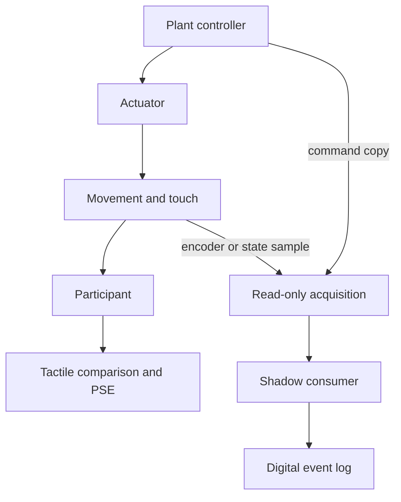

# Proposed device and timing contract

**DVC20261010 — design contract only.** All hardware application fields below are OPEN unless expressly marked as a property of the finite model. No board or experimental rig was accessed by this worker.

## 1. Device-to-model correspondence

The selected published apparatus is identified in RESEARCH_NOTE.md reference [1]. The following additions are proposals; their availability is not established by the article or its behavioral dataset.

| Model item | Proposed physical interpretation | Evidence required before an actual claim |
|---|---|---|
| Device-command source `M_D` | A copy taken from one identified drive-command path | Name the exact producing operation, port/wire/register, command episode and separation from the plant path. A passive drive command is not a participant efference copy. |
| State source `P_E` | An identified position/encoder stream or independently added sensor | Document source API or electrical port, unit, quantization, generation time, latency and whether the sample refers to the current consequence or an earlier state. |
| Acquisition port | The physical value present immediately before a capture | Measure actual arrival; a host send timestamp or transmitted packet is insufficient. |
| Gate | A mechanism that permits or prevents capture into one specified buffer | Verify where it operates. A downstream output mask, read-everything-then-multiply routine or disabled sample request may implement different consumption relations. |
| Buffer | A persistent register or protected memory cell | Verify initial state, invalidation, writer exclusivity, cache visibility, overflow and overwrite behavior. |
| Snapshot | Two immutable cells committed for one designated episode | Demonstrate exclusion or version validation; retain the actual capture ancestry. A common header alone is insufficient. |
| Consumer | One specified digital operation that reads the snapshot | Audit executable/firmware semantics and a validated read instrument. The logger's own declarations are not independent evidence of every read. |
| Digital output | A task function of the designated inputs | Keep it separate from human endpoint data and from the command driving movement or touch. |

The manufacturer documents `HD_CURRENT_POSITION` in millimeters and `HD_CURRENT_ENCODER_VALUES` as raw encoder values (RESEARCH_NOTE.md [5]). It also documents frame snapshots and previous-frame behavior for queries outside frames ([4]). These provide concrete interface candidates to inspect. The selected study's actual call sites, SDK version, firmware and source timestamps remain OPEN; a documented force-setting buffer is not an Arduino rail command or a measurement of physical motion.

## 2. Causal separation

This is the **proposed model separation**, not a verified wiring diagram of the published experiment. The shadow has no outgoing path to the plant or participant endpoint. Under that condition, changing its gates is a digital-consumer intervention; it does not manipulate a human neural consumer. Shared power, processing resources, visual feedback, sound, experiment instructions or stimulus scheduling can create omitted paths, so actual separation must be checked.

A human task occurring alongside the digital probe does not close the evidence gap. The prospective primary perceptual target is tactile-comparison PSE; independently fitted sigma and source-labelled JND are kept as separate precision quantities. This future choice is not retrospective preregistration. No agency, ownership or H endpoint is generated by the model.

## 3. Event record required per accepted episode

Record source origin IDs, physical source names, episode assignment, payloads, source-emission times, actual port-arrival times, gate transitions, capture times, buffer-write IDs, invalidations, snapshot copies/commit, consumer read IDs and output. Keep metadata epoch fields separate from grounded source-episode identity. Record the reference clock, timestamp resolution and uncertainty, including whether times describe a command call, software completion, electrical edge, device motion or tactile onset.

The modeled source events and hardware claims are distinct. Retain raw observations that could falsify the correspondence rather than recording only a precomputed PASS flag. Occurrence IDs must not be recycled during the claimed comparison without an explicit wraparound protocol. Hardware reset, repeated command values and duplicate packets do not by themselves establish token continuation.

## 4. Timing inequalities

For each lane `i`, suppose the intended token is valid on `[a_i,b_i)`, with `a_i in [a_i^-,a_i^+]` and `b_i in [b_i^-,b_i^+]`. For setup/hold aperture `[s_i-u_i,s_i+h_i]`, robust capture requires and, in the stated independent bounded-uncertainty model, is guaranteed by:

`a_i^+ + u_i <= s_i < b_i^- - h_i`.

The gate must be valid over its separately specified aperture. Capture completion must precede commit, commit must precede the selected reads, and no writer may change the committed cells before those reads. Clock-domain uncertainty must be included in the bounds; two timestamps on unrelated clocks cannot establish the inequality by subtraction.

For a common sample time, the two safe intervals must intersect. If they do not, individually valid captures may still be paired after both complete, provided their episode relation is independently correct and their buffers survive. This is a delayed same-episode pair, not simultaneous physical sampling. Any predictor deadline, processing latency, resource conflict or retention limit can defeat the proposed schedule and must be included before deployment.

All example times in model.py are dimensionless ordered ticks. They are not milliseconds, device specifications, or measured worst-case latencies.

## 5. Preparation and commit state machine

1. Begin a uniquely identified test episode and fix its expected source-token identities and availability mask.
2. Invalidate the selected buffers, or use a separately proved masked/epoch-filtered preparation with equivalent absence semantics. Closing a capture gate alone is not reset.
3. Independently establish the command-copy and state-source arrivals. Test arrivals at the actual acquisition ports.
4. Capture each enabled lane only inside its validated window. Preserve disabled absence. A payload zero is still a supplied token.
5. Retain captures with actual source and episode ancestry. Reject missing, swapped, stale or unresolved inputs; do not substitute the most recent convenient value silently.
6. Commit an immutable paired snapshot. Release the designated consumer only after commit. Read-event semantics must match the tested executable.
7. Preserve the output and the full failure/arrival/capture/read record. Keep plant and tactile measurements separate.

If any condition fails, the affected episode is an invalid realization of the stated consumer cell. This is not a claim of absent experience or an adverse human diagnosis.

## 6. Required negative controls

Use a warm-buffer closed-gate trial; delay one arrival past capture; consume before commit; overwrite a live buffer after commit; create a mixed-epoch pair; exchange source ports; replay an older token with a new metadata header; compare a gate-label reflex and a direct-port bypass; and use a supplied-zero payload with its gate still open. These controls test distinct obligations. A successful control does not exclude every hidden pathway outside the specified rival class.

## 7. Outstanding actual parameters

The proposed source-copy port, state interface, acquisition electronics, firmware, read instrument, capture windows, clock relation, gate aperture, invalidation semantics, snapshot exclusion, resource isolation and hardware evidence are all OPEN. The original study's public behavioral observations do not contain this added event contract. The next authorized research step can prepare and review these items; no successful physical implementation is claimed from the current code.
