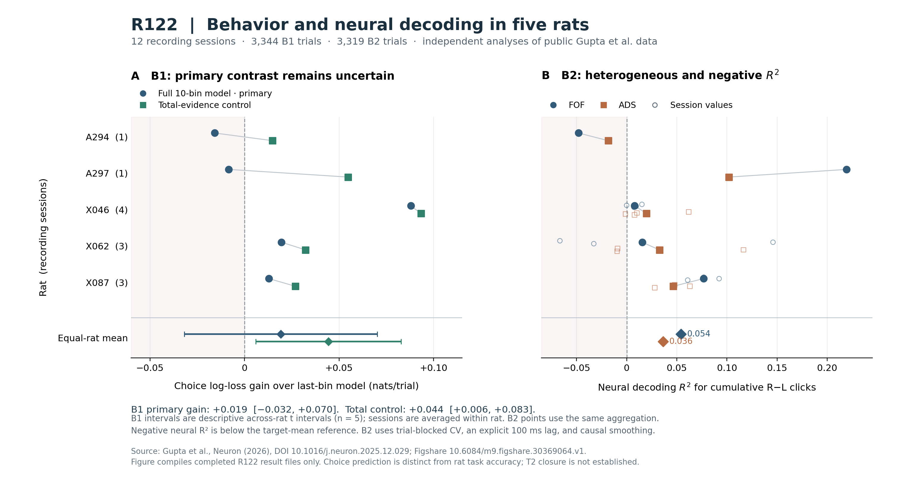

# R122 — Real rat B1/B2 reanalysis and the still-open T2 certificate

Date: 2026-10-06. Research checkpoint for Hongju Liu's UCT experience–intelligence cross-substrate project. Repository: `thechurchofagi/trinity-accord`; branch: `uct-agent-consciousness-workspace`. Continuation baseline: `ab02cb6ea51442aa434bdfbe3ef69d52d2877996` (R121). No later numbered round was present when work began.

## 1. Outcome and contribution

**The public `Cells.zip` transfer blocker is resolved. B1 and B2 have actually run on all 12 original rat recording sessions, with independent raw-data and numerical checks. T2 mechanism correspondence is still not closed.**

The distinction matters. We now have independently computed biological observations instead of a pending download and paper-level evidence alone. The results also constrain the earlier optimistic comparison: the primary flexible behavioral kernel contrast is inconclusive, and conservative neural decoding is modest and heterogeneous. Neither computation identifies the biological state-transition law or transports a neural intervention to the artificial accumulator.

This round adds no toy theorem, new artificial training run, second capability domain, experiential label, or publication release. It preserves the completed R117 AI run and R121 theoretical closure. The new contribution is a reproducible biological measurement and audit, including unfavorable results, not the invention of biological–RNN accumulation comparisons. The original paper already contains such comparisons and perturbation modeling [S1, S3].

All new scripts, fixed protocols, source ledgers, source-row identities, held-out predictions, coefficients, fold memberships, failures, and review outputs are in [the R122 artifact directory](R122_Biology_B1_B2_20261006/README.md). Detailed [B1](R122_Biology_B1_B2_20261006/R122_B1_Report.md), [B2](R122_Biology_B1_B2_20261006/R122_B2_Real_Data_Results.md), [primary-methods](R122_Biology_B1_B2_20261006/R122_Primary_Methods_and_T2_Audit.md), and [independent-review](R122_Biology_B1_B2_20261006/independent_review.md) reports support the claims below.

## 2. Public source, exact identity, and input coverage

The biological source is Gupta et al., *A multi-region recurrent circuit for evidence accumulation in rats*, *Neuron* 114(3), 521–535.e5 (2026), DOI [10.1016/j.neuron.2025.12.029](https://doi.org/10.1016/j.neuron.2025.12.029). The versioned dataset is [10.6084/m9.figshare.30369064.v1](https://doi.org/10.6084/m9.figshare.30369064.v1). Author code is pinned to [39d056fb12f688034b543d9ac8b7406a58ad0f77](https://github.com/Brody-Lab/fof_ads_interactions/tree/39d056fb12f688034b543d9ac8b7406a58ad0f77).

The first ordinary streamed request in this execution succeeded through Figshare's signed S3 redirect. No unavailable-data claim is warranted. Historical failed transfers remain historical failures; they were not evidence that the public archive did not exist.

| Archive identity | Verified value |
|---|---|
| Stable download endpoint | `https://ndownloader.figshare.com/files/58773835` |
| Exact bytes | 1,929,137,550 |
| MD5, matching Figshare | `3b0ab5c964fb492ec36ee0f55a5d53de` |
| SHA-256 | `e23a5c281b828c5d9545576ebc9197f37dbc20bd16c616aa2eda55d220fe9494` |
| MATLAB sessions / rats | 12 / 5 |
| Original trial rows | 5,230 |
| Eligible B1 trials | 3,344, including 45 exact evidence ties |
| B2 trials / held-out time bins | 3,319 / 32,656 |
| Source units before population filters | 3,014 |

The complete final author-hosted PDF was also obtained: 38 pages including supplements, 11,663,991 bytes, SHA-256 `8daabdb02884a87b51c0c618f64c7f14a53e92b20eda7eaf70132ff640f24789`. The source ledgers distinguish full downloads from the specific sections actually read. The article PDF and multi-gigabyte raw archive are retained by their upstream sources; the package contains reproducible retrieval, exact source identities, and derived results rather than redistributing the article.

### Schema findings that materially affect interpretation

The shared loader preserves the original filename and one-based MATLAB row throughout filtering. It removes the common first stereo click using the author's `raw[1:] - raw[0]` transformation. The two onset timestamps agree, and reconstructed right-minus-left counts match `Trials.click_diff` in every eligible trial. `stateTimes.clicks_on` is an absolute session/BControl timestamp: adding `cpoke_in` again would misalign the spikes. Opaque MATLAB identity objects are bypassed using matching plain source metadata [S3; schema and independent raw audits].

Seven sessions provide `recorded`; all supplied flags are true. Five omit it, and this remains missing metadata. A294 alone contains 3,956 NaN spike timestamps in 54 units. B2 conservatively excludes five behaviorally eligible trials whose relevant support intersects finite-neighbor brackets around those NaN runs. Those brackets represent uncertainty, not confirmed recording-gap boundaries. Twenty other trials fail the declared complete lagged-window rule. A297 has 40 eligible rows without `cpoke_out`; stimulus cutoffs still apply, but universal pre-exit coverage cannot be claimed for them. Two X087 sessions have actual stimuli exceeding the paper's simplified one-second range; actual durations are retained.

All twelve sessions have `laser.isOn = 0`. **This is no new B3 optogenetic trial replication.** R118's 309 registry rows and 222 retained sessions remain a separately established registry audit; the registry is not complete optogenetic trial behavior [S5].

## 3. B1 — temporal evidence and observed choice

### Fixed analysis

B1 is an independent analysis requested by this project. No corresponding author behavioral temporal-kernel estimator was found in the pinned repository and searched final article/supplement; this is not a claimed reproduction of an author kernel.

Each session is fit separately with four fixed L2 logistic models (`C=1`, LBFGS, tolerance `1e-8`, maximum 2,000 iterations). They share actual duration, prior rewarded signed choice, prior error signed choice, and a missing-history indicator. History means the previous original source row. The evidence predictors are ten normalized-duration click-count differences (`full10`), only the final fraction (`lastbin`), one total count (`total`), or none (`nuisance`). Errors and evidence ties remain in the data.

Five contiguous whole-trial folds and a one-retained-trial boundary purge separate fitting from held-out prediction. Scaling is training-only. This is blocked within-session choice prediction conditional on available observed history; it is not new-rat generalization or unconditional prediction of an entire unseen choice sequence. Kernels from full-data fits are descriptive coefficients, not causal intervention effects. The protocol was fixed locally before choice-effect fitting, after initial schema inspection; it was not externally preregistered.

### Results, with the primary contrast retained

Sessions are averaged within rat, then the five rats receive equal weight. Log loss measures prediction of the animal's actual choice; the accuracy column is **not the animal's task correctness**.

| Prespecified model | Held-out log loss, lower is better | Choice-prediction accuracy |
|---|---:|---:|
| Flexible ten-bin kernel | 0.587307 | 0.710356 |
| Final-bin control | 0.606539 | 0.678490 |
| Total-evidence control | 0.562148 | 0.725328 |
| Nuisance-only control | 0.691398 | 0.561456 |

The **primary** `full10` versus `lastbin` log-loss improvement is **0.019232**, with a descriptive five-rat t interval **[−0.031799, 0.070263]**. Two rats, A294 and A297, have worse flexible-kernel prediction. The primary comparison therefore remains inconclusive.

The prespecified `total` control improves over `lastbin` by **0.044391**, interval **[0.005989, 0.082794]**, with the favorable direction in **12/12 sessions and 5/5 rats**. This control is the strongest result, but does not replace the original primary contrast. The flexible model is worse than `total` in 11/12 sessions. Limited per-session data and model variance can contribute to this pattern; it does not prove that the true temporal weights are equal.

The predeclared absolute-time sensitivity uses 902 trials lasting at least 0.8 seconds, four 200 ms bins, and a post-0.8-second evidence nuisance term. Early coefficient intervals are broad; only the last 600–800 ms bin has a positive descriptive interval. No uniformly strong early-to-late kernel is established.

The justified observation is that a wider evidence-history summary improves held-out choice prediction over the final normalized fraction under the tested model family. It neither proves continuous integration on every trial nor excludes every intermittent/snapshot strategy. It is not a replication of the artificial accumulator's flat causal pulse profile [B1 report; S4].

## 4. B2 — cumulative external evidence decoded from FOF/ADS

### Fixed conservative analysis

The target is physical cumulative right-minus-left clicks at 50 ms endpoints, not an inferred experience label and not the paper's separately fitted choice-conditioned subjective-accumulator posterior. Each target bin is paired with a neural bin delayed by 100 ms. Firing rates use a causal half-Gaussian, sigma 75 ms, truncated at four sigma, with trial-isolated support. Neural bins end during the actual stimulus and before a known valid center-poke exit.

Each session and region has separate Lasso fits. Five outer and three inner contiguous whole-trial folds are used. Training splits alone determine firing-rate eligibility (>1 Hz), seeded outcome-blind matched region counts, scaling and regularization choice from `[0.01, 0.03, 0.1, 0.3, 1, 3, 10]`. Seed is 122; convergence limit is 20,000 iterations with tolerance `1e-4`. Matched populations range from 5 to 52 units per region per outer fold. All 12 sessions completed with zero fitting failures and zero convergence warnings.

### Results and limits

These are averages of session metrics within rat, then equal-rat averages, not one pooled model or out-of-rat transfer score. Predictive R² is `1 − SSE/SST`, not the square of Pearson r; it can be negative.

| B2 statistic | FOF | ADS |
|---|---:|---:|
| Held-out Pearson r | 0.184790 | 0.136561 |
| Held-out predictive R² | 0.054277 | 0.036449 |
| Same-time / within-choice centered descriptive r | 0.049238 | 0.042104 |

The figure is rendered from saved results only; filled points summarize rats, and open B2 points retain the individual sessions. Its B1 intervals are the descriptive five-rat intervals already specified above.

Eight of the 24 session-region R² values are negative. The paired rat-level FOF−ADS r contrast is **0.048229**, with descriptive cluster-bootstrap interval **[−0.031930, 0.128388]**. Neither stable regional superiority nor regional equivalence is established.

The centered diagnostic uses strata of saved held-out predictions; it is not an independently cross-validated nuisance-adjusted prediction model. A prespecified eventual-choice/time/duration control has equal-rat R² **0.200573**, or **0.495881** when the recent click difference is added. Those controls use the eventual choice and are descriptive, not available online to an accumulator before the decision. They emphasize that decoding a cumulative stimulus statistic alone need not identify stored history or its causal use.

The pinned author execution path flattens trial-time rows before shuffled validation, normalizes the whole session before validation, and creates a declared lag without visibly applying it to onset alignment. R122 also changes smoothing, population selection, validation depth and the observation domain. These are directly documented source differences [S3; primary-methods audit]. **The lower R122 scores cannot be attributed uniquely to any one difference and do not independently refute Figure 2C.** This round preserves one fixed conservative reanalysis; it does not tune the pipeline toward the published scores.

## 5. Independent validation and preserved failures

The separate reviewer did not import the shared loader to reconstruct raw behavioral counts. All 33,440 B1 temporal features, 3,344 trial histories, 60 session-fold partitions and boundary purges, saved metrics and equal-rat intervals were checked. Four first-fold A294 behavioral fits reconstructed the held-out probabilities to within `1.12e-16`.

For B2, all 32,656 targets were reconstructed from raw MATLAB clicks. Every nested split, trial membership, timing relation, matched population count and saved metric was checked. Manual reconstruction of 378 causal firing-rate values in A294/A297 agreed within `2.14e-14` Hz; checked training scalers and stored readouts agreed within `1e-13`. These checks establish computational consistency, not the biological mechanism.

Input-inspection failures remain in the records: `whosmat` fails on an opaque object with a `NoneType` iteration error; an initial strict loader rejected genuine NaN spikes; assuming universal `recorded` availability failed; an upstream `Brody-Lab/npx-utils` retrieval returned 404. Selective MAT loading and explicit missing-data handling resolved analysis-blocking schema issues. The exact origin of the NaN run remains unconfirmed. No primary session failure or negative score was discarded.

## 6. R119 T2 certificate: a vector, not a decoder score

The labels below refer to **T2.C0–C6**, distinct from UCT's foundational C1. PASS is limited to its stated domain; UNCERTAIN means the required correspondence has not been established. Missing evidence is not silently scored as success or called a falsified mapping without a declared test.

| Component | R122 status | Evidence now available | Remaining requirement |
|---|---|---|---|
| C0 grounding consistency | **PASS, restricted task coordinate** | Raw external left/right counts, sign, source clocks and choices audited; count-history semantics can be shared with R117. | This does not equate stimulus distributions, neural states, content labels or physical timing. |
| C1 baseline correspondence | **UNCERTAIN** | Real rat B1 predictions and existing R117 artificial behavior. | Matched input/nuisance domain, output-law comparison and a predeclared error tolerance. |
| C2 transition commutation | **UNCERTAIN** | Modest cumulative-stimulus decodability. | A causally justified biological state and transition map; decoding is not an update-law test. |
| C3 intervention transport | **UNCERTAIN** | Executed R117 artificial interventions; separate published biological perturbation evidence. | Corresponding actual ports and independently assessable matched intervention responses. The recording archive contains no laser-on trials. |
| C4 temporal correspondence | **UNCERTAIN** | Audited biological clocks, explicit observation lag and physical time windows. | A shared temporal map for state updates and interventions; normalized fractions are not R117 physical bins. |
| C5 nuisance stability | **UNCERTAIN** | All sessions and rats reported; blocked validation, count matching and descriptive controls. | Stable declared correspondence bounds across difficulty, laterality, conditions and model realizations; present heterogeneity is retained. |
| C6 anti-triviality / mapping discipline | **UNCERTAIN; analysis discipline completed** | External target, low-complexity frozen estimators, held-out predictions and controls. | A part/port-grounded state map tested against correlate-only and wrong-port alternatives. |

Machine-readable versions are [CSV](R122_Biology_B1_B2_20261006/R122_T2_Certificate.csv) and [JSON](R122_Biology_B1_B2_20261006/R122_T2_Certificate.json). **Overall: `T2_NOT_CLOSED`; `T3_NOT_ESTABLISHED`; `G4_NOT_ESTABLISHED`.**

R117's 59,571 synthetic trials, artificial task accuracy, direct accumulator-state R² and +1 pulse effects have different distributions, units and readout definitions from B1/B2. In particular, its `r2_score(cum, cum + N(0,1))` has no trained neural decoder or held-out-trial evaluation. Its accuracy uses Gaussian decision noise (sigma 3), whereas its pulse probabilities use a sigmoid (temperature 3). Those are different output laws; a later C1/C3 comparison must explicitly calibrate them rather than treating the two sets of results as the same Y. The historical results remain unchanged. None of these numbers can rank rat versus AI intelligence or experience. A +1 external pulse, an instantaneous midpoint reset, a 500 ms FOF→ADS inhibition and whole-FOF suppression remain different interventions until an actual port map is established [S3, S5; continuity read ledger].

## 7. Research implication and the next narrow step

The next blocker is now **mechanism identification and intervention correspondence**, not public-data access. A narrow follow-up should first specify an evidence-grounded candidate biological state, corresponding neural/artificial ports, time map, and quantitative acceptance bounds. If protocol differences must be resolved to select that state, declare a limited one-factor sensitivity comparison on the same 12 sessions, retaining R122 as the unchanged baseline. Do not select whichever decoder variant produces the most attractive score.

Intervention closure additionally requires trial-level biological perturbation outcomes or an equivalently auditable primary source, with the registry kept separate. No author contact or message was sent in this round. Absence of that material must leave C3 open; it does not justify substituting another artificial demonstration. This round stops after the requested B1/B2 completion and certificate update.

R121's foundational distinctions remain unchanged: complete K and complete E-type are the conditional UCT C1 identity pair; A/I/S/B/R/V are different projections or relations. Realized intelligence is experience-bearing under U1/C1. Under fixed complete comparison conditions, actual process boundaries and a common complete K signature, a genuine capability difference implies a complete E-type difference, without implying experiential refinement, scalar increase or a more human-like quality. Equal capability or a higher score does not identify equal or scalar-more experience. Self, access and report are not experience-existence gates. In the empirical AI comparison E remains latent throughout, and selected external click content is not a valence measure. T1 functional analogy, T2 mechanism correspondence, and T3/G4 constitutive experiential-structure homology remain separate.

G1, G2, G3 and G4 concern behavioral geometry, representational geometry, anchored causal geometry and constitutive content homology respectively. A decoder score alone does not even establish a cross-substrate G2 geometry comparison. Weak decoding does not establish absence of causal support or experience; strong decoding does not establish causal use. The four deeper open problems remain selected structural homology to ordinary phenomenal labels, the valence/fear bridge, unified subject/bearer boundaries and composition, and external empirical validation or falsifiability of C1/U1. No new generic theory layer is needed to restate these limits [S5].

## Sources and reading scope

- **S1:** Gupta et al., final *Neuron* article, [DOI](https://doi.org/10.1016/j.neuron.2025.12.029), [author-hosted complete PDF](https://dikshagup.github.io/publication/multiregion-accumulation/multiregion-accumulation.pdf). Source/section scope in `R122_Methods_Source_Ledger.json` and `R122_B1_Source_Schema_Ledger.json`.
- **S2:** Figshare version 1, [DOI](https://doi.org/10.6084/m9.figshare.30369064.v1), [version API](https://api.figshare.com/v2/articles/30369064/versions/1), file 58773835. Complete archive verified and all 12 MAT sessions analyzed. Metadata, download receipt, archive inventory and per-file hashes are preserved.
- **S3:** Brody-Lab, [pinned author repository](https://github.com/Brody-Lab/fof_ads_interactions/tree/39d056fb12f688034b543d9ac8b7406a58ad0f77), particularly trial preprocessing, evidence decoding, neural-activity/filter helpers and figure assembly. Exact file hashes and read scope are in the ledgers. Source observations apply to this inspected code path, not unknown unpublished paths.
- **S4:** Kopec et al., [primary preprint DOI 10.1101/2024.08.21.609064](https://doi.org/10.1101/2024.08.21.609064), targeted kernel/snapshot identifiability reading recorded in the methods ledger. This supplies a limitation and prior-art check, not new data analyzed in R122.
- **S5:** Project [R117](R117_First_Real_Cross_Substrate_Evidence_Accumulation_20261006.md), [R118](R118_Biological_Public_Data_Boundary_Audit_20261006.md), [R119](R119_T2_Intervention_Preserving_Support_Certificate_20261006.md), [R120](R120_Experience_Intelligence_Bridge_Theorem_Schema_20261006.md), [R121](R121_Experience_Intelligence_Closure_Audit_20261006.md), and [R121 master handoff](UCT_Experience_Intelligence_Cross_Substrate_Master_Handoff_R121_20261006.md). These are historical claims and continuity constraints, not newly rerun experiments. The R122 continuity ledger records the actual additional review scope.

No published A/B/C or TA-TR-2026-24 bytes were changed. This is a branch research checkpoint, not a new journal submission or archival release.
