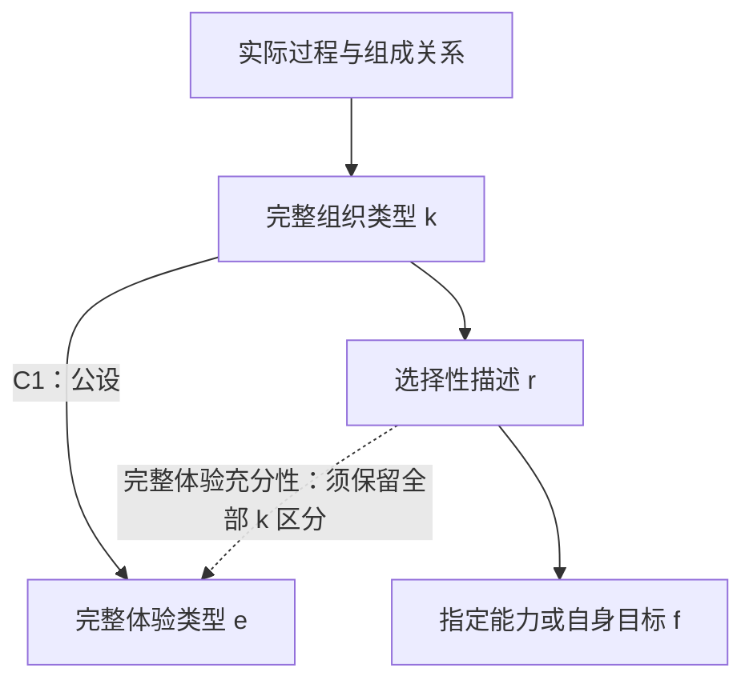

# 九篇来源统一形式地图 — R149

2026-10-07。当前地图 R149-v1.0，391 节点 / 188 条规则。新增条目主要是把前作已有结论明确接入，不是新增这么多个定理。九篇也不是作者全部论文的穷尽计数。

## 1. 现在如何接在一起

| 地图来源 | 接入的核心内容 | 在当前理论中的角色 |
|---|---|---|
| A / UCT I v1.2 | 实际过程、完整组织、C1、非空体验、主体选择边界 | 当前公设与本体基础 |
| B / UCT II v1.1 | 不同理论的机制语言、物理/语义桥接 | 条件翻译，不自动证明他种理论 |
| C / UCT III v1.0 | 固定任务的智能、信息保留和组织类型 | 能力与体验关系的已有定理 |
| D / TA24 v1.0 | 当前承担者、后继、任务延续与证据分层 | 功能延续不等于恐惧或体验存在证据 |
| TA15 v1.0 | 分型目标、纤维判据、运输组合、误差 | 条件推理工具与更早来源 |
| TA16 v1.0 | 共同见证、连接/信息反例、冗余、重编码 | 数学结果保留；旧 RRH-E 单列历史猜想 |
| TA17 v1.0 | 内部自我归属、因果继承、后继集合及损失 | 明确已有自我形式化，不能重复报新 |
| TA18 v1.0 | 实际参与、PRD、商空间、主体选择 | 独立桥接假设；两步过强推论已加前提修正 |
| TA19 v1.0 | 对称选择、轨道、路径追踪、拓扑限制 | 已有数学先例；计算表格与证明分开 |

这一轮完成核心定义与证明分支的接图。并不宣称九篇全部文字、实验和每个外部引用都已复核无误。TA19 正式 Markdown 在 §5 结束，补充材料已取回；缺失正文覆盖不能用摘要替代。详见[来源审计](SOURCE_INTEGRATION_AND_AUDIT.md)。

## 2. 主线地图

图中 k→r 仅在 r 是允许的类型不变描述时适用；一般定理允许 r 还含外部标记。r→f 也需要纤维一致条件，不是任意描述自动有用。虚线不是无条件推导。

## 3. 本轮集中推导出的兼容性结论

固定同一类实际承担者、时间范围、完整比较语言。令 k 是完整组织类型，e 是完整体验类型，r 是某个描述。在 C1 给出的类型等价前提下：

\[
\boxed{e=h\circ r\quad\Longleftrightarrow\quad
r(\omega)=r(\omega')\Rightarrow k(\omega)=k(\omega')}
\]

含义是：**一个描述若合并了两种不同的完整组织类型，就不能同时被称为完整体验的充分描述。** 但它仍可以准确描述某项能力、身体状态或一个体验侧面。

证明很短但前提不能省略：r 相同若能决定 e，就给出 e 相同；C1 随后要求 k 相同。反向只需按 r 的每个纤维给出其唯一 k 类型，再使用 C1 的对应。完整英文证明与反例见[研究正文](COMPATIBILITY_AND_SELF_TARGETS.md)。这是已有数学工具的项目内兼容性应用，不是新发现一般数学定理。

## 4. 自我定义的实际推进

现在把三个问题分开：**实际指向谁、系统把它归属于谁、系统预测得多准。** TA17 的 M_attr 表示内部归属；R147 的 beta 表示独立确定的实际装配关系；sigma/tau 表示感知/动作绑定。不能用 M_attr 的内容定义 beta 的真值，否则错误归属无法被表示。

目标可以是整个承担者、其实际组成部分、外部工具，或跨边界/重叠关系；它相对于哪个承担者必须明确。同一工具相对个人可以在外，相对实际的人—工具交互过程可以在内。这不等于任意组合都成为一个主体。

“预测正确”与“归属正确”能够分离。即便同时换接感知和动作后闭环仍预测准确，也不能据此证明它指向原来的身体。模型不完整，也不等于它对选定目标的预测一定错误。在 UCT 内，模型归属错误不构成实际承担者无体验的证明。

## 5. 思想实验在论证中的位置

| 思想实验 | 它要检查的推论 | 当前可保留的结论 |
|---|---|---|
| 所有祖先及组织条件的形成中间体都存在 | 渐进变化是否证明任何体验的首次发生 | 强迫区分体验存在与某项新能力；渐进性本身不证明 C1 |
| 算盘与电子计算器 | 相同算术结果是否代表相同完整组织/体验 | 能力目标与承担者要明确；完整体验充分性要另证 |
| 人列运行智能体 | 个体、实际整体、算法能否直接等同 | 局部与整体可分别研究；不自动推出唯一整体主体 |
| 复制、双换接与记忆交换 | 准确预测/相同记忆是否证明自身指向和身份 | 内部归属、实际连接、因果延续及数值身份必须分开 |

## 6. 重要修正与仍开放的问题

TA18 的 AND/XNOR 例子：先要明确保留联合干预信息，才能说所选因果描述不同；即便描述不同，任意体验桥也未必区分它们。常量桥就是反例。本轮地图保留物理结论，对体验结论增加显式区分前提。旧原文没有被偷偷改写。

TA16 的旧 RRH-E 不作为新的普遍体验门槛塞回当前 UCT；TA18 的 PRD 与 C1 是否兼容，用上面的同目标判据逐项检查。保留部分目标、保留不同实际承担者的可能，不能草率宣告九篇互相矛盾。

本轮完成了来源接图、关键推论修复和一条集中的兼容性推导。仍未证明一般语义自指或某种具体“感觉自己”的机制。独立原创论文的重大增量尚未认证；下一步应集中解决一个明确实现类别中的目标绑定与错误归属，而不是增加无关小定理或开始生物实验。

[全量证明台账](PROOF_LEDGER.md)保留每项前提、证明和限制；[核查记录](VALIDATION.json)记录形式与来源检查。
